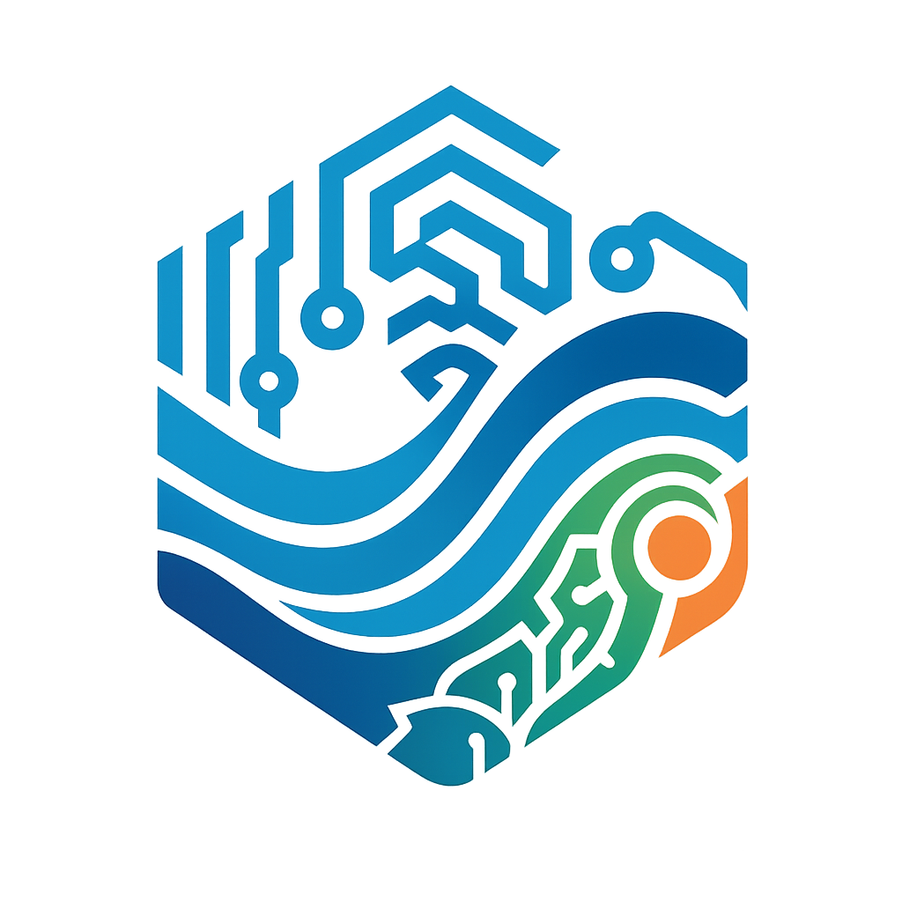
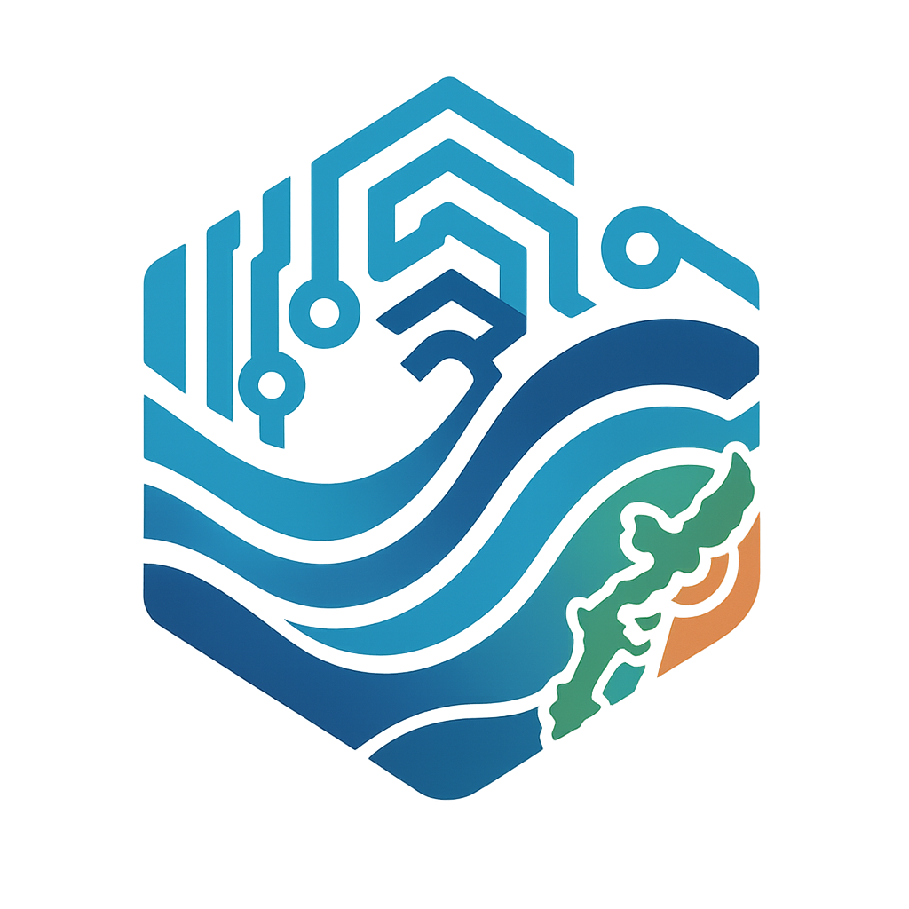

# DESIGN — 何を見せるか

AI.LandBase のデザインシステム。語り口は [BRAND.md](./BRAND.md)（言葉）、ここは **見た目（visual taste）** を扱う。両者は対になっている。

## ロゴ



六角形のバッジに、ブランドの 4 要素を一枚で重ねている。

| 要素 | 意味 | BRAND との対応 |
|---|---|---|
| 六角形 | 土地・基盤（LandBase） | 地域に根ざす |
| 回路パターン（青） | AI・テクノロジー | 統合された AI ツール群 |
| 波（青のグラデーション） | 沖縄の海 | 地域密着 |
| 太陽（オレンジ）＋緑 | 島の自然・温度感 | 伴走者の温かさ |

原本: [`assets/logo.png`](./assets/logo.png)

### バリアント

| バージョン | ファイル | 備考 |
|---|---|---|
| 標準 | [`assets/logo.png`](./assets/logo.png) | 基本ロゴ。README・名刺などで使用 |
| 沖縄バージョン | [`assets/logo-okinawa.png`](./assets/logo-okinawa.png) | 沖縄本島のシルエットを描き込んだバリエーション |



### 使い方
- 余白を十分に取り、回路と波のディテールが潰れないサイズで使う
- 背景は白〜淡色（Mist）を基本にする。濃色背景に置く場合は単色化版を別途用意する（未作成 → 下記「未確定」）

## カラーパレット

ロゴから抽出した実色をトークン化している。

| トークン | HEX | 役割 | 由来 |
|---|---|---|---|
| Tech Blue | `#0090C0` | プライマリ（リンク・主要素） | 回路・AI |
| Ocean Blue | `#004890` | 深色・見出し・コントラスト | 波・海 |
| Island Green | `#2E9A63` | セカンダリ・成功/自然系 | 緑・島 |
| Sun Orange | `#F07830` | アクセント（CTA・強調） | 太陽 |
| Ink | `#14202B` | 本文テキスト | — |
| Mist | `#F4F8FB` | 背景・面 | — |

### ブランドグラデーション
ロゴが描く流れ＝ **Tech Blue → Island Green → Sun Orange**（AI から海・島・太陽へ）。ヒーローや区切りに限定して使い、多用しない。

```css
:root {
  --color-tech-blue: #0090C0;
  --color-ocean-blue: #004890;
  --color-island-green: #2E9A63;
  --color-sun-orange: #F07830;
  --color-ink: #14202B;
  --color-mist: #F4F8FB;
  --brand-gradient: linear-gradient(120deg, #0090C0, #2E9A63, #F07830);
  --brand-gradient-narrow: linear-gradient(120deg, #0090C0, #2E9A63); /* 細帯・小面積用（橙は混ぜない） */
}
```

#### 使用ルール（濁り回避）
緑 → 橙は色相がほぼ補色で、sRGB の直線補間だと中間が `#8F8949`（くすんだオリーブ）に濁る。広い面では引き伸ばされて目立たないが、**細い帯・小面積ではこの濁りがそのまま見える**。

- 3色の `--brand-gradient` は **広い面（ヒーロー・大きな区切り）に限定**して使う。
- **細い帯・小面積では2色の `--brand-gradient-narrow`（Tech Blue → Island Green）** を使う。中間がティールで澄む。
- **Sun Orange は面で混ぜず、点アクセント**（ドット・記号・小要素）として効かせる。
- どうしても細所で3色を使うなら、緑↔橙の間を彩度の高い黄で橋渡しし、オリーブを通さない設計にする。

> 名刺の左端バーはこのルールに従い `--brand-gradient-narrow`、橙はワードマークの「.」で点アクセント化している。

## タイポグラフィ

BRAND のボイス（伴走者＝温かく・誠実・噛み砕く）に合わせ、硬すぎない humanist sans を基本にする。

- **和文**: Noto Sans JP（本文・見出しとも）。可読性を最優先し、ウェイトで階層をつける
- **欧文・数字**: Inter など可読性の高い sans
- 等幅は技術文脈（コード・トークン表記）に限定

> 確定フォントは制作時に最終決定する（上記は方向性）。

## トーンの接続（BRAND ↔ DESIGN）

| BRAND の姿勢 | ビジュアルでの表現 |
|---|---|
| 伴走者（上から教えない） | 角を立てすぎない曲線・波のモチーフ、余白を活かす |
| 地域密着（沖縄・北部） | 海と島の色（青〜緑〜橙）を基調にし、無国籍な配色を避ける |
| 噛み砕いて伝える | 過度な装飾を避け、コントラストと階層で読みやすく |

## 適用物（テンプレート）

デザインシステムを適用した制作物。色・フォントは上記トークンに揃えてあり、本ドキュメントを一次情報として更新する。

| 制作物 | ファイル | 備考 |
|---|---|---|
| 見積書 | [`assets/templates/quotation/template.html`](./assets/templates/quotation/template.html) | ブラウザで開き「PDFで保存／印刷」。実データ（金額・宛名）はサンプル |
| 名刺 | [`assets/templates/business-card/card.svg`](./assets/templates/business-card/card.svg) | 91×55mm（塗り足し・トンボ付き）。ロゴは埋め込み済み |

> いずれも雛形。配布・入稿時に実データへ差し替える。

## 未確定（今後）

- ロゴの単色版・モノクロ版・最小サイズ規定
- ファビコン／OGP 画像
- 確定フォントとウェイトスケール
- README・公式サイトへの適用ガイド（余白・配置）
